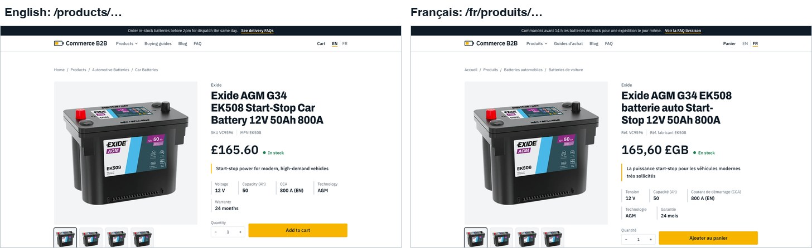

# Commerce B2B storefront

**Live:** https://contentful-commerce-b2b.vercel.app (English at `/`, French at `/fr`) · **Staging:** https://contentful-commerce-b2b-git-staging-rza-kalfanes-projects.vercel.app

A headless B2B storefront for trade batteries. **Content** (pages, articles, guides, FAQs, navigation, banners) lives in
**Contentful**; the **catalog, prices and cart** live in **BigCommerce**; **Next.js 16** (App Router) composes them.
The site is bilingual (English at `/`, French at `/fr`) and editors can edit it in Contentful's Live Preview.

This is the same storefront as the other CMS versions (ContentStack, Amplience and more; same pages, images and UI), with Contentful as the CMS.
Pages and posts are **ordered lists of blocks** that editors can reorder in Contentful. The UI, content model and Contentful provider are the
same as in the private repo `content-commerce-b2b` (a switchable-CMS build); this repository is that code reduced to Contentful only: no switcher,
no Amplience code.


```
  Contentful (US)                 BigCommerce (headless channel)
  content, 2 locales              catalog, prices, cart, checkout
        │  Delivery / Preview API         │  Storefront GraphQL
        └──────────────┐      ┌──────────┘
                       ▼      ▼
                 Next.js 16 storefront  ──►  Visitors (EN / FR)
                       ▲
             Live Preview (editors)
```

## What is in it

| Area | What you get |
|---|---|
| **Home** | A page of blocks: hero with a staggered photo pair, intro text, shop-by-category mosaic, value blocks, trade favourites, guides; editors reorder them |
| **Catalog** | Mega menu from the live category tree; listing and category pages with search-as-you-type, sort, and brand / technology / voltage / warranty / price filters; filters apply on click and show as removable chips |
| **Product page** | Gallery, price, stock, key specs, volume pricing, description, spec table, related guides and products, structured data |
| **Cart** | Add to cart, dynamic quantity stepper with instant totals, remove, hosted checkout hand-off |
| **Content** | Blog (36 articles, 6 authors), 6 buying guides, 15 FAQs, banners, announcement bar, navigation |
| **Languages** | English and French: routes, UI text, prices, dates and all Contentful content (field-level localization) |
| **Editing** | Contentful Live Preview: click an element to jump to its field, reorder blocks, typed changes appear as you type (links and media after save); French through the site's language switcher |
| **Design** | "Workbench": light theme, 1100px pages, photography-led |

## Screenshots

<table>
<tr>
<td width="50%"><br><sub>Listing: search-as-you-type, removable filter chips, facets from BigCommerce</sub></td>
<td width="50%"><br><sub>Product page: gallery, price, stock, key specs, add to cart</sub></td>
</tr>
<tr>
<td><br><sub>Cart: instant quantity changes, saved to BigCommerce</sub></td>
<td><br><sub>The same page in English and French</sub></td>
</tr>
<tr>
<td><br><sub>Mega menu built from the live category tree</sub></td>
<td><br><sub>Buying guide with numbered steps and recommended products</sub></td>
</tr>
<tr>
<td><br><sub>Live Preview: click an outlined element, edit its field in the form</sub></td>
<td><br><sub>French in Live Preview, reached with the site's language switcher</sub></td>
</tr>
</table>

## Quick start

Requirements: Node 22+, Python 3.12+ with Pillow (only for the seeding scripts), a Contentful space and a BigCommerce
store with a storefront channel.

```bash
cd storefront
npm install
cp .env.example .env.local      # then fill in the values (see docs/operations.md)
npm run dev                     # http://localhost:3000   (French: /fr)
```

Common commands:

```bash
npm run dev          # development server (Turbopack)
npm run dev:https    # same over HTTPS, needed to edit in Contentful Live Preview
npm run lint         # ESLint
npx tsc --noEmit     # type-check
npm run build        # production build

# Model and seed the space (idempotent; needs CONTENTFUL_MANAGEMENT_TOKEN)
python3 tools/contentful/schemas.py   # locales (en, fr) + the 18 content types (--prune removes fields/types no longer in the model)
python3 tools/contentful/seed.py      # assets and entries, English + French, published
python3 tools/contentful/verify.py    # counts and French content via the Delivery and Preview APIs
python3 tools/contentful/editor.py    # Live Preview content preview platforms
python3 tools/contentful/backup.py    # save the whole space to .backups/ before a destructive change
```

## Project layout

```
app/
  [locale]/                  every page lives under the locale segment
    layout.tsx               html lang, edit support, announcement bar, header (mega menu), footer
    page.tsx                 home (the Page with slug `home`)
    [...slug]/page.tsx       any other Page by slug: faq, guides, blog, or a page an editor adds
    blog/[slug]  guides/[slug]   article and guide detail pages
    products/                listing, and [...slug] for categories and product pages
    cart/                    cart
  actions/cart.ts            server actions: add to cart, set quantity, remove
  globals.css                design tokens and base/component styles
proxy.ts                     locale routing (English rewritten to /en, French under /fr), translated catalog roots,
                             `/home` rewrite, verified draft header, frame-ancestors for Contentful
core/
  content.ts                 the content model: Block, Page, Post, Guide, Faq, Spotlight, Navigation...
  edit.ts                    edit attributes (`$`) and the `tag(entity, field)` helper
providers/cms/
  contentful/                client (Delivery/Preview API, link resolution, overlay), mapper (entries to the model), index,
                             actions (server actions for Live Preview), live-preview, edit-support
  gates.ts  meta.ts          draft gate (`cf_preview` secret), frame-ancestors origins
components/                  UI building blocks: page-blocks (one view per block type), page-content, hero, cards, mega menu, cart...
lib/
  content.ts                 facade the pages call (getPage, getPosts, getGuide...), reads through the Contentful provider
  request.ts                 `isPreviewRequest()`: the proxy's verified preview header
  bigcommerce.ts             Storefront GraphQL: products, categories, search, cart
  i18n.ts                    locales, URL helpers, UI strings, label maps
tools/contentful/            content model, seeders, backup, verification, Live Preview setup, French translations, photos
docs/                        documentation (start at docs/README.md)
HISTORY.md                   every request and its result
```

## Documentation

Start with **[docs/README.md](docs/README.md)**. Highlights:

- [Architecture](docs/architecture.md): how the pieces fit, routing, rendering and caching
- [Implementation details](docs/implementation.md): how each feature works
- [Contentful](docs/contentful.md): the space, tokens, the block content model, reading and publishing
- [Live Preview](docs/visual-editor.md): preview secret, inspector mode, languages, troubleshooting
- [BigCommerce](docs/bigcommerce.md): channel, token, queries, listing, cart
- [Internationalization](docs/i18n.md): locales, URLs, translation workflow
- [Seeding](docs/seeding.md): sample content scripts, backup and pruning
- [Design system](docs/design-system.md): tokens, type, components
- [Operations](docs/operations.md): environment variables, deployment, troubleshooting
- [Decisions](docs/decisions.md): why things are the way they are

## Important notes

- **All sample content is fictional.** Author names, article text, FAQ policies, delivery claims and the
  `example.com` contact details are placeholders. Replace them before going public.
- **Product, category and custom-field text is translated by BigCommerce** (Store Translations) and read with the locale
  directive, with BigCommerce's translated catalog URLs (`/products/...`, `/fr/produits/...`) and a language switcher that finds the
  matching page. UI text, navigation and fallbacks live in `lib/i18n.ts`.
- The Contentful space is on the **Free plan** (2 locales, 25 content types; the model uses 18). Switching the preview locale inside the editor is a Premium feature,
  so French is edited through the storefront's own language switcher ([decisions.md](docs/decisions.md), D30).
- Secrets live only in `.env.local` (gitignored). The management token is used by the seeding scripts, never by the
  running storefront; the live site reads published content with the Delivery token, and drafts need the preview secret.
