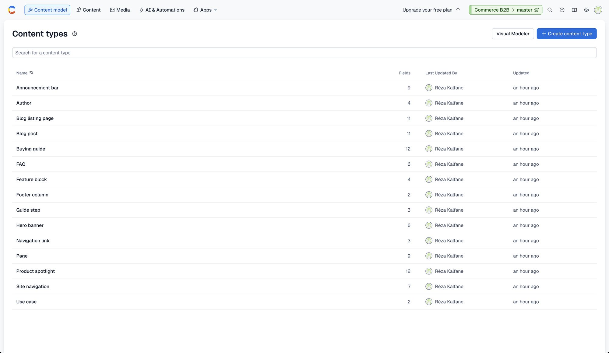
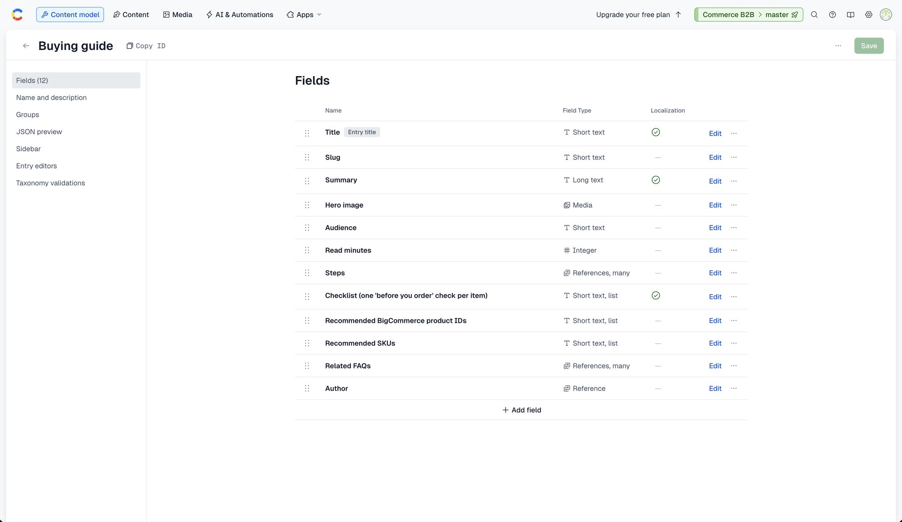
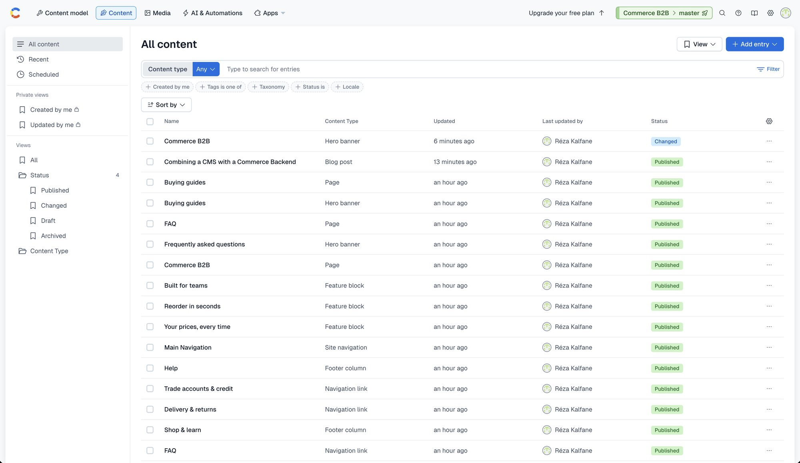
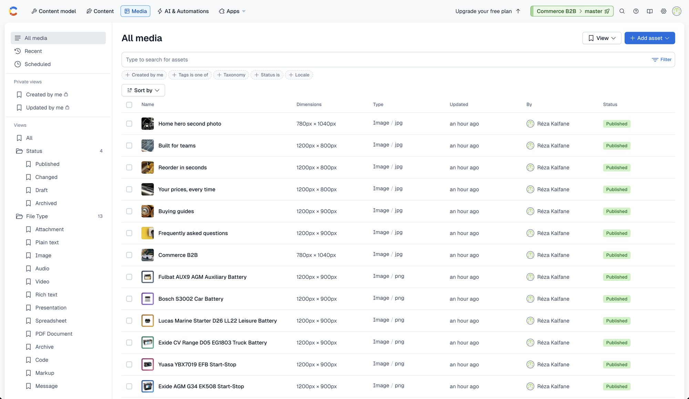

# Contentful

## The space

| Setting | Value |
|---|---|
| Space | "Commerce B2B" (US data region) |
| Hosts (US) | Management API `https://api.contentful.com`, Delivery API `https://cdn.contentful.com`, Preview API `https://preview.contentful.com`, uploads `https://upload.contentful.com` (EU spaces: `api.eu.`, `cdn.eu.`, `preview.eu.`, `upload.eu.`) |
| Environment | `master` (set by `CONTENTFUL_ENVIRONMENT`) |
| Locales | `en` (default) and `fr` (falls back to `en`), localized **per field** in one entry |
| Plan | Free (see [decisions.md](decisions.md): D29 and D30 for what that limits) |
| Content preview | One preview platform per site origin, created by `scripts/seed/editor.py` ([visual-editor.md](visual-editor.md)) |

The region comes from `CONTENTFUL_REGION` (`us` or `eu`). A space is only reachable through its own region's hosts.

## Access tokens

| Token | Used by | Sees |
|---|---|---|
| **Delivery** (`CONTENTFUL_DELIVERY_TOKEN`) | the live site | published entries and assets only |
| **Preview** (`CONTENTFUL_PREVIEW_TOKEN`) | editor requests and local development | drafts and published; kept server-side |
| **Preview secret** (`CONTENTFUL_PREVIEW_SECRET`) | the storefront | not a Contentful token: a random string put in the content preview URL (`?cf_preview=<secret>`); only requests carrying it may read drafts |
| **Management token** (`CONTENTFUL_MANAGEMENT_TOKEN`) | the seeding scripts (Management API) | read and write the whole space; **never** needed to run the site, never sent to a host or the browser |

Delivery and Preview tokens are created in the web app (Settings → API keys); the management token is a personal access token
(Settings → CMA tokens). The storefront reads published content with the Delivery token and the Preview token only when a request
carries the preview secret ([visual-editor.md](visual-editor.md#how-draft-mode-is-switched-on)).

## Content model



A content type's fields, with the localization marker on the translatable ones:



Fifteen content types: nine root types and six reusable pieces. All are defined in `scripts/seed/schemas.py` (the plan allows 25).
Contentful has no inline blocks, so the pieces are **separate entries linked from their page**.

### Root types

| Content type | Purpose | Key fields |
|---|---|---|
| `page` | A page of the site: home, FAQ, the buying-guides index | `title`, `slug` (`home`, `faq`, `guides`), `description`, `hero` (link to a `heroBanner`), `image`, `intro` (rich text), `blocks` (links to `featureBlock`s), `seoTitle`, `seoDescription` |
| `blogListingPage` | The blog index | `title`, `hero`, search texts, `featuredPosts` and `relatedPosts` (links to posts) with their headings, SEO |
| `blogPost` | An article | `title`, `slug`, `author` (link), `date`, `featuredImage`, `body` (rich text), `relatedPost` (link), `isArchived`, SEO, `seoKeywords` |
| `author` | Article / guide author | `name`, `slug`, `picture`, `bio` |
| `faq` | A question and rich-text answer | `question`, `slug`, `answer`, `topic` (enum), `sortOrder`, `isFeatured` |
| `buyingGuide` | Step-by-step guide | `title`, `slug`, `summary`, `heroImage`, `audience` (enum), `readMinutes`, `steps` (links to `guideStep`s), `checklist` (array of text), `recommendedBcProducts` and `recommendedSkus` (arrays of text), `relatedFaqs` (links), `author` |
| `productSpotlight` | Editorial layer over a BigCommerce product | `title`, `slug`, **`bcProductId`**, `bcSku`, `tagline`, `editorialSummary`, `keyFeatures` (array), `useCases` (links to `useCase`s), `pairsWellWithSkus`, `badge` (enum), `editorialImage`, `isFeatured` |
| `announcementBar` | Scheduled site-wide banner | `title` (internal), `message`, `ctaLabel`, `ctaHref`, `style`, `audience`, `startsAt`, `endsAt`, `isActive` |
| `siteNavigation` | Header, footer and contact details | `headerLinks` (links to `navLink`s), `footerColumns` (links to `footerColumn`s), `salesEmail`, `supportPhone`, `openingHours`, `legalText` |

### Reusable pieces (entries)

`heroBanner` (title, description, image, `ctaLabel`, `ctaHref`, `fullWidth`), `featureBlock` (title, rich-text copy, image, layout
`image_left` / `image_right`), `guideStep`, `useCase`, `navLink`, `footerColumn`.

They are entries rather than inline blocks because Contentful has none. The cost is one more click for editors (open the linked entry),
and the benefit is that a hero can be reused ([decisions.md](decisions.md), D4).

### URLs

| Entry | URL |
|---|---|
| `page` with slug `home`, `faq`, `guides` | `/`, `/faq`, `/guides` |
| `blogListingPage` | `/blog` |
| `blogPost` | `/blog/<slug>` |
| `buyingGuide` | `/guides/<slug>` |
| `author`, `faq`, `productSpotlight`, `announcementBar`, `siteNavigation` | no page of their own |

Each routable entry has a **unique `slug`** field (not localized: slugs are shared across languages).

### Field conventions

- **Localized fields** hold one value per locale in the same entry (`fields.title.en`, `fields.title.fr`). Unlocalized fields (slugs, links,
  numbers, flags) only have the default locale.
- **Enums** (`topic`, `audience`, `badge`, `style`) are Symbol fields with a validation list that store fixed English values; the storefront maps
  them to French labels for display (`topicLabel`, `audienceLabel`, `badgeLabel` in `lib/i18n.ts`). Add a choice in both places.
- **Lists of strings** are Array of Symbol fields (`checklist`, `keyFeatures`, `recommendedBcProducts`, `recommendedSkus`). `recommendedSkus` is optional and
  only a display fallback ([decisions.md](decisions.md), D33).
- **Numbers and dates are real types** (`Integer`, `Date` as ISO strings).
- **Buttons** are `ctaLabel` + `ctaHref` (a storefront path such as `/guides`); the app adds the `/fr` prefix.
- **Links** to other entries or assets are `Link` fields (`{ sys: { type: "Link", linkType, id } }`); the storefront resolves them.
- **Rich text** is Contentful's JSON document (headings 2 and 3, lists, hyperlinks, bold and italic), rendered to HTML.

## Content volume (sample)



The 62 images live in the media library:



| Type | Entries |
|---|---|
| `author` | 6 |
| `blogPost` | 36 |
| `blogListingPage` | 1 |
| `page` | 3 (`home`, `faq`, `guides`) |
| `faq` | 15 |
| `buyingGuide` | 6 |
| `productSpotlight` | 6 |
| `announcementBar` | 2 |
| `siteNavigation` | 1 |
| `heroBanner` | 4 |
| `featureBlock` | 3 |

Plus guide steps, use cases and navigation links, and 62 assets. All content is fictional sample text, in English and French.
`python3 scripts/seed/verify.py` checks these counts on the Delivery and Preview APIs.

## Reading content

All reads go through `lib/contentful.ts` (`getEntries`, `getEntry`) and are mapped to the storefront's shapes by `lib/blog.ts` and
`lib/site.ts` ([implementation.md](implementation.md#1-data-layer)).

```
GET https://cdn.contentful.com/spaces/<space>/environments/master/entries?content_type=buyingGuide&fields.slug=<slug>&locale=fr&include=3&limit=1
GET https://cdn.contentful.com/spaces/<space>/environments/master/entries?content_type=faq&locale=en&include=3&limit=1000
```

- `locale=en|fr` selects the language; where French has no value, the field falls back to English (the French locale's fallback).
- `include=3` returns linked entries and assets in `includes`; `resolve()` in `lib/contentful.ts` replaces each link with its target, down to
  3 levels. A link whose target is unpublished (or deleted) is **dropped**, so a published page never shows a draft.
- Lists return up to 1000 entries per request.
- Published reads are cached by Next.js for 60 seconds (tag `contentful`); draft reads are never cached.
- Asset URLs are protocol-relative (`//images.ctfassets.net/...`) and normalised to `https:`.

## Publishing

Saving an entry updates its **draft**; **Publish** makes the draft the published version for **all locales at once**. A published entry can
only link to published entries, so publish the pieces before the page that uses them (the seed does). The live site shows published
content within about a minute. There is no approval gate: review with the editor's live preview, or the staging deployment, before
publishing ([operations.md](operations.md)).

## Plan and limits

- The space is on Contentful's **Free** plan: 25 content types, 10,000 records, 2 locales. Adding the French locale was refused (403) until
  space capacity was freed (D29), and the editor's locale switch is a Premium feature (D30).
- The Management API is rate-limited (a few requests per second); the seeding scripts pace themselves and retry on `429`.
