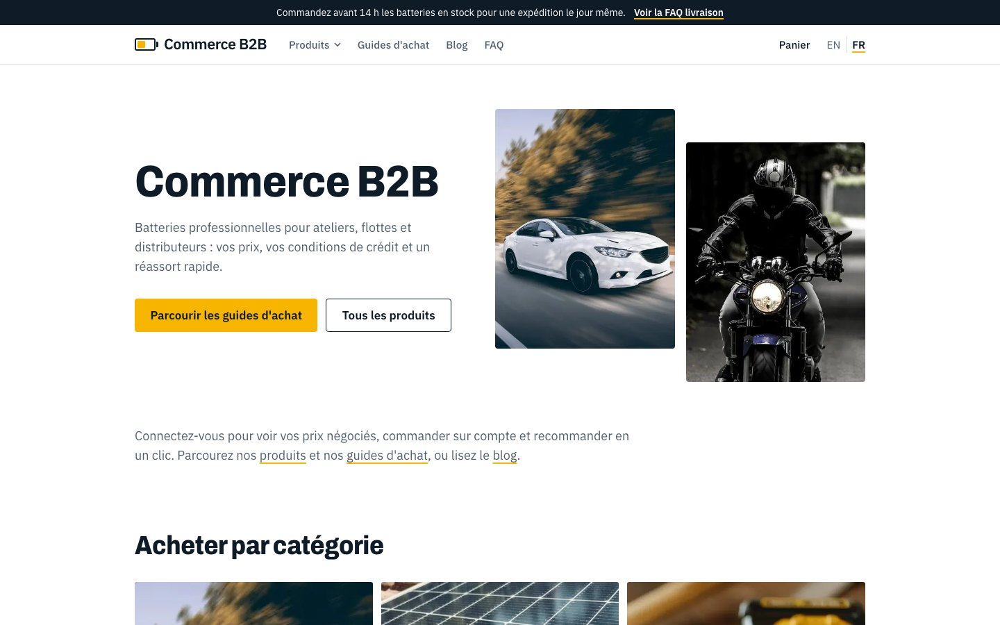

# Internationalization

Languages: **English** (default) and **French**. The architecture supports more.

*The same product page in English (`/products/…`) and French (`/fr/produits/…`): product name, breadcrumbs, spec labels, UI text and prices (`165,60 £GB`) follow the language, and so does the URL.*

## URL strategy

| URL | Locale | Notes |
|---|---|---|
| `/blog`, `/products/…` | English | clean URLs, no prefix |
| `/fr/blog`, `/fr/products/…` | French | prefix `/fr` |
| `/en/blog` | → 308 redirect to `/blog` | each page has one canonical address |

`proxy.ts` implements this: `/fr/…` passes through; `/en/…` redirects; everything else is **rewritten** to `/en/…`
internally. All routes live under `app/[locale]/`.

Locale codes:

| URL segment | Contentful locale | Formatting (Intl) | `lang` |
|---|---|---|---|
| `en` | `en` (the default locale) | `en-GB` | `en` |
| `fr` | `fr` | `fr-FR` | `fr` |

Defined in `lib/i18n.ts` (`LOCALES`, `CF_LOCALE`, `INTL_LOCALE`). Helpers: `localePath(locale, "/blog")`,
`stripLocale(pathname)`, `isLocale(value)`. **Always build links with `localePath`**, including links stored in
Contentful (`/faq`, `/blog`), which are stored *without* a prefix.

## What is translated and where

| Content | Where | Mechanism |
|---|---|---|
| Articles, guides, FAQs, banners, pages, navigation, announcements, spotlights, authors | Contentful | **field-level localization**: localized fields hold one value per locale (`en`, `fr`) in the same entry |
| Buttons, labels, messages, filter and cart text | `lib/i18n.ts` (`en` / `fr` dictionaries) | `getMessages(locale)`; the `Messages` type forces both languages to define every key |
| Select-field values (FAQ topic, guide audience, spotlight badge) | `TOPIC_FR`, `AUDIENCE_FR`, `BADGE_FR` | `topicLabel` / `audienceLabel` / `badgeLabel` |
| Category labels | `CATEGORY_FR` | `categoryLabel` |
| Product specs (names, common values) | `SPEC_NAMES_FR` + rules | `translateSpec` |
| Dates and prices | `Intl` | `formatDate`, `formatMoney` |
| Product names, descriptions, categories, custom fields | BigCommerce | Store Translations, read with the locale directive; URLs keep the English slugs (see [bigcommerce.md](bigcommerce.md)) |

## Content fallback

Every read passes `locale=fr` (or `en`). The French locale's **fallback is English**, so a localized field with no French value returns the English
value and the site never shows a hole. The reverse is not true: English never falls back to French. Because an entry holds both locales, there is no
"missing French version" of a whole page: only individual fields can be untranslated.

## Slugs: shared for content, translated for the catalog

Content pages (blog, guides, FAQ) use the same slug in both languages (`/fr/blog/contract-pricing-101-giving-every-buyer-their-own-price`),
which keeps the language switcher exact (swap the prefix). The **catalog** uses BigCommerce's translated URLs
(`/products/automotive-batteries/...` and `/fr/produits/batteries-automobiles/...`), so its language switcher looks the page up
([implementation.md](implementation.md#the-catalog-routes)). See [decisions.md](decisions.md), D9 and D11.

## SEO

Pages that matter export `generateMetadata` with `alternates: alternatesFor(locale, path)`, which emits `canonical` and
`hreflang` links (`en`, `fr`, `x-default`). `<html lang>` follows the locale.

## Language switcher

*The French home page: header with the language switcher (EN / FR), translated hero, navigation and announcement bar.*

`components/locale-switcher.tsx` (client) reads the current path, strips any prefix and links to the same path in every
locale, preserving the query string (filters survive a language change).

## Translating content in Contentful

**Via the app:** open an entry; localized fields show an English and a French input one under the other. Fill the French one, then publish.
Publishing covers all locales at once.

**Via the scripts** ([seeding.md](seeding.md)): translations live in Python files (`content_fr.py`, `content_fr_posts.py`); `seed.py`
writes each entry's English and French values together (`fields.title.en` and `fields.title.fr`).

Checklist for a fully translated page:

1. Every localized field of the entry (and of its linked pieces: hero, steps, nav links…) has a French value.
2. Entries it links to (authors, FAQs) are translated too (their own fields).
3. Enum values still match the allowed English values.
4. Links stored in fields are **unprefixed** (the app adds `/fr`), except inside rich-text, where they must be written with the prefix
   (`/fr/products`) because the HTML is rendered as-is.

In Live Preview, the storefront's own EN / FR switcher opens the French page; the editor's locale menu is a Premium feature
([visual-editor.md](visual-editor.md#languages), [decisions.md](decisions.md) D30).

## Adding another language (for example German)

1. **Contentful**: add the locale (Settings → Locales, or `schemas.py`), for example `de`. The Free plan allows two locales, so this needs a larger plan.
2. **`lib/i18n.ts`**: add `"de"` to `LOCALES`; add entries to `CF_LOCALE` (`de`), `INTL_LOCALE` (`de-DE`),
   `LANGUAGE_NAME`; add a `de` messages object (the type checker lists every missing key); extend the label maps
   (`TOPIC_`, `AUDIENCE_`, `BADGE_`, `CATEGORY_`, `SPEC_NAMES_`).
3. **`proxy.ts`**: allow the new prefix (`first === "fr"` → a list of non-default locales); update the `stripLocale` regex in `lib/i18n.ts`.
4. **Content**: translate the fields (app, or a `content_de.py` and an extra `de` value per localized field in `seed.py`).
5. **`alternatesFor`**: add the language to `languages`.
6. Verify: `/de`, the switcher, a product page, the cart, a blog post.

## Known gaps

- Brand names come from BigCommerce as stored (not translated).
- Switching language on a catalog page redirects through `/api/switch-locale`; attribute filters (`f.*`) are dropped because their values are translated.
- Rich-text links need the locale prefix written by hand.
- The French announcement/promo claims are as fictional as the English ones.
- There is no automatic locale detection from `Accept-Language` (visitors choose with the switcher); add it in `proxy.ts` if wanted.
