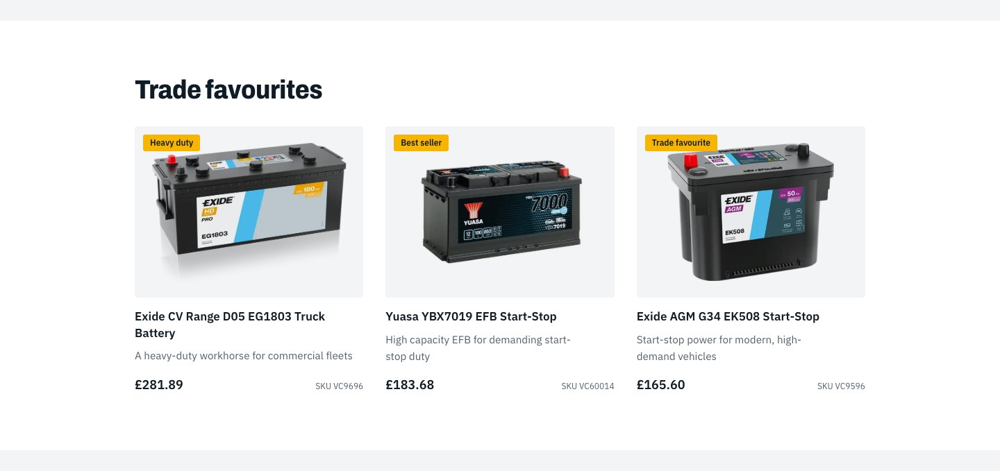
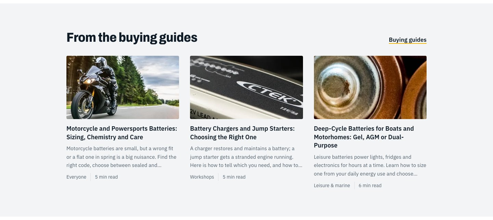
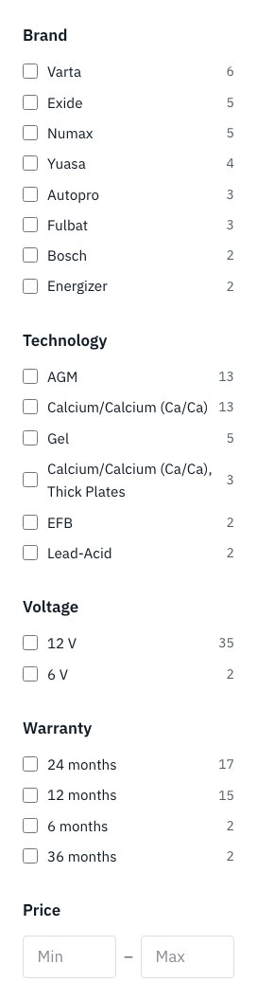
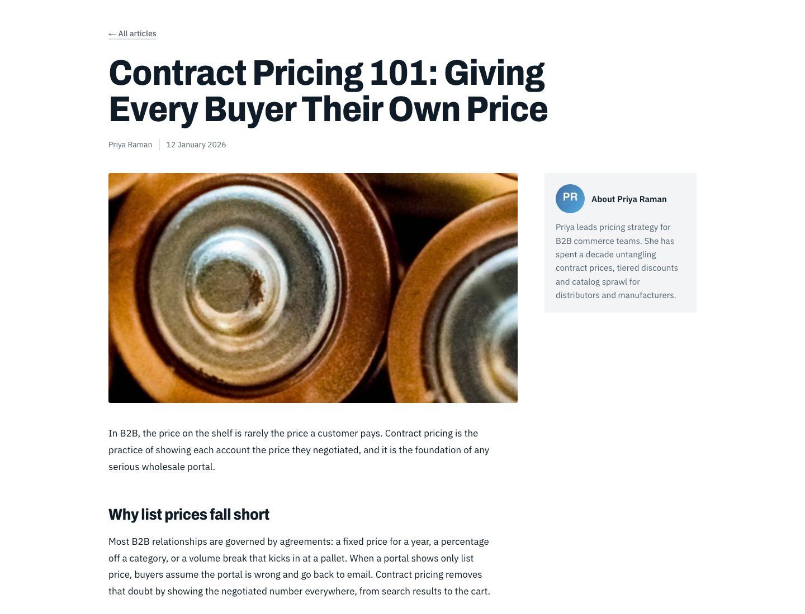

# Implementation details

How each feature works and where to find it. Paths are relative to `storefront/`.

## 1. Data layer

### Contentful: `providers/cms/contentful/`, `core/content.ts`, `lib/content.ts`

- **`core/content.ts`** is the content model every component renders: `Page { title, description, blocks }`, the `Block` union (`hero`, `text`,
  `image`, `video`, `feature`, `categories`, `spotlights`, `guides`, `posts`, `postListing`, `guideListing`, `faqs`), `Post` (with its own
  `blocks`: text, image, video), `Guide`, `Faq`, `Spotlight`, `Author`, `Navigation`, `Announcement`. Every entity and block can carry `$`, the
  Live Preview attributes (empty outside preview).
- **`lib/content.ts`** is the facade the pages and components call: `getPage(key, locale)`, `getPosts`, `getPost(slug, locale)`, `getGuides`,
  `getGuide(slug, locale)`, `getSpotlights`, `getNavigation`, `getAnnouncement`, plus `pageLabel`. It delegates to the Contentful provider; no
  page or component names Contentful. (The optional `at` argument is a time-travel hook that Contentful ignores.)
- **`providers/cms/contentful/client.ts`**: `getEntries(contentType, locale, draft, params?)` and `getEntry(contentType, slug, locale, draft)` are the
  only entry points for reading. They pick the locale (`en` / `fr`) and the API (Delivery with the delivery token, or Preview with the preview
  token when `draft` is set), ask for `include=3`, replace links with the entries and assets they point to (`resolve()`, three levels; a link
  to an unpublished target is dropped), and wrap the call in React `cache()`. Published reads use `revalidate: 60` with the tag `contentful`;
  drafts are `no-store` (plus the 5-second draft cache and the typed-edit overlay, see section 9). `getBaseline(ids, locale)` reads saved draft
  values for Live Preview.
- **`providers/cms/contentful/mapper.ts`** turns entries into the model: assets become `{ url, alt }`, `ctaLabel` + `ctaHref` become `{ label, href }`,
  arrays of text become `string[]`, rich text becomes HTML, `collectionBlock` entries become the right block for their `kind`, and
  `page.components` / `blogPost.content` become ordered `blocks`. `editTags(entry, draft)` builds `$` for draft requests, mapping a model field name
  to the Contentful field id of that content type (for example `html` is `copy` on a `featureBlock` and `text` on a `textBlock`).
- **`providers/cms/contentful/index.ts`** exposes the reads as the provider; each one asks `isPreviewRequest()` (`lib/request.ts`) whether the
  request is a verified draft preview, so pages never pass preview state around.
- Pages are looked up by the **`slug`** field (`getPage("home")`, `getPage("faq")`...), posts and guides by slug too. Slugs are identical in every locale
  (see [decisions.md](decisions.md)). Authors are mapped from the resolved link, and related FAQs come from the resolved links.
- Rich text (text blocks, feature copy, FAQ answers) is converted to HTML by `documentToHtmlString` from `@contentful/rich-text-html-renderer`; a malformed
  document renders as empty.

### BigCommerce: `lib/bigcommerce.ts`

A thin GraphQL client (`gql()`), the query fragments, and typed functions. Details in [bigcommerce.md](bigcommerce.md).

## 2. Pages

| Route | File | Data |
|---|---|---|
| `/` | `app/[locale]/page.tsx` | the `home` Page, rendered block by block |
| `/faq`, `/guides`, `/blog`, any other page slug | `app/[locale]/[...slug]/page.tsx` | the Page with that slug (`notFound()` if none) |
| `/blog/[slug]` | `blog/[slug]/page.tsx` | one `blogPost` (its blocks) + author + related reading |
| `/guides/[slug]` | `guides/[slug]/page.tsx` | `buyingGuide`, related FAQs, live BigCommerce products |
| `/products`, `/fr/produits` | `products/page.tsx` | BigCommerce faceted search over the whole catalog |
| `/products/<category>…`, `/fr/produits/<categorie>…` | `products/[...slug]/page.tsx` | category **or** product (see below) |
| `/cart` | `cart/page.tsx` | BigCommerce cart |

The Page routes call `PageContent` (`components/page-content.tsx`), which fetches the Page and hands its `blocks` to `PageBlocks`
(`components/page-blocks.tsx`): one view per block type, consecutive feature blocks share a band, and `spotlights` blocks fetch live
BigCommerce products. `PostContent` and `GuideContent` do the same for articles and guides. Which request is a draft is decided by the proxy
(`x-preview`), so the pages carry no preview code. The layout renders `EditSupport` (`components/edit-support.tsx`), which loads the Live
Preview SDK only for verified preview requests.

### The catalog routes

BigCommerce translates catalog URLs, so the catalog lives at `/products/...` in English and `/fr/produits/...` in French (the root category
"Products" is "Produits" in French, and every category and product slug below it is translated too). There is **one static route**,
`app/[locale]/products/page.tsx` (listing) and `app/[locale]/products/[...slug]/page.tsx` (category or product), because the page route
`[...slug]` would otherwise swallow a dynamic root segment. `proxy.ts` rewrites each language's catalog root onto `/products/...` (for example
`/fr/produits/...` to `/fr/products/...`) and passes the requested root in the `x-catalog-root` header, which the pages read with
`requestedCatalogRoot()` (`lib/catalog-route.ts`); the root of each language is `CATALOG_ROOT` in `lib/i18n.ts`.

- The page rebuilds the BigCommerce path from `root` and the slug (`/produits/batteries-automobiles/...`) and resolves it **in the page's
  language**: a path only resolves in its own language. **One or two segments are categories, three or more are products.** If the guess is
  wrong the other interpretation is tried, and `notFound()` is raised if neither resolves.
- `ensureCatalogRoot()` (`lib/catalog-route.ts`): another language's root (an old or content-stored link such as `/fr/products/...`) is
  **permanently redirected** to the same page in this language; any other first segment is a 404.
- Product and category reads include `locales`, BigCommerce's list of the page's path in every language. It feeds `hreflang` / canonical
  tags (`alternatesFromPaths`) and the language switcher.
- **Language switcher:** on a catalog page it links to `/api/switch-locale?to=fr&path=<current path>`, which looks up the page's path in the
  target language and redirects (307), keeping the other query parameters and dropping attribute filters (`f.*`, whose values are translated).
  Other pages just swap the `/fr` prefix.
- `localePath(locale, "/products")` (the bare catalog link used in navigation, footer, buttons and breadcrumbs) maps to the language's root.
  Tiles and the mega menu use the translated paths from the category tree; tile photos are matched by category id.

## 3. Home page

The `home` Page is a list of blocks, in the order an editor puts them (seeded as follows):

- **Hero** (`components/hero.tsx`, variant `home`): the page's `heroBanner` gives the headline, description, button and the two staggered photos
  (`image` and `secondImage`, both selectable in Live Preview). A secondary "All products" button is added in code for the home variant.
- **Intro**: a `textBlock` (rich text).
- **Shop by category** (`categories` collection, `components/category-tiles.tsx`): the five top-level catalog categories as a photo mosaic. The
  photos are static files in `public/images/categories/`; labels are localized (`categoryLabel`).
- **Value blocks**: three `featureBlock`s (title, copy, image, layout `image_left` / `image_right`) in one band.
- **Trade favourites**: a `spotlights` collection whose items are `productSpotlight` entries, enriched with live BigCommerce price, photo and link.
- **From the buying guides**: a `guides` collection (the first three guides) with a link label.

Reordering, adding or removing a block in Contentful changes the page; the code only knows how to draw each kind of block.

*Trade favourites: editorial content from Contentful with live price, photo and link from BigCommerce.*

*A value block (title, copy, image, layout).*

*The guides strip: the first three guides, with photo, audience and read time.*

## 4. Navigation, mega menu and announcement bar

- **Header links** come from the `siteNavigation` entry. The link whose `href` is `/products` is replaced by the
  **mega menu**.
- **Mega menu** (`components/mega-menu.tsx`, columns built in `components/site-chrome.tsx → megaColumns`): the live
  BigCommerce category tree (top level with subcategories and product counts), localized labels and a photo per top-level
  category. Hover previews it; a click pins it open; Escape, an outside click or navigating closes it. The panel is
  absolutely positioned under the header.
- **Announcement bar**: the first `announcementBar` that is active, inside its date window and aimed at guests
  (`audience` is `everyone` or `guests`); style `info` (ink), `promo` or `warning` (amber).
- **Footer** columns, contact details and legal line come from the `siteNavigation` entry.
- **Cart link** shows the item count by reading the cart cookie and asking BigCommerce (`CartLink`, in a `Suspense`).

*The mega menu: five top-level categories with photos, subcategories and live product counts.*

## 5. Product listing and categories

`components/plp.tsx` renders: search box, result count, **active filter chips**, "Clear all", sort, facets, product
grid and pager. It is a plain GET `<form>`, wrapped by `components/plp-form.tsx`.

*A category with a search term and a technology filter applied: result count, chips with "Clear all", sort, facets, product grid.*

### Query parameters

| Parameter | Meaning |
|---|---|
| `q` | search text (3+ characters) |
| `brand` (repeatable) | brand entity IDs |
| `f.Technology`, `f.Voltage`, `f.Warranty` (repeatable) | attribute facet values |
| `min`, `max` | price range |
| `sort` | `featured` (default), `newest`, `best_selling`, `price_asc`, `price_desc`, `name_asc` |
| `after` / `before` | cursor pagination |

`parseCatalogParams()` reads them; `searchCatalog()` runs the query ([bigcommerce.md](bigcommerce.md)).

### Interaction model

- **Filters apply on click.** `PlpForm` listens for checkbox changes, serialises the form to a URL and calls
  `router.push(url, { scroll: false })` inside `useTransition`. The grid dims (`group-data-[pending=true]:opacity-50`)
  while the server re-renders. Without JavaScript the form still works as a normal GET form (a `<noscript>` button).
- **Search as you type** (`components/search-box.tsx`): submits 350 ms after typing stops, only for 3+ characters (or
  when emptied). One or two characters show a hint and do nothing; Enter is ignored below three.
- **Price range** (`components/price-range.tsx`): applies 700 ms after typing stops.
- **Chips and "Clear all"** are server-rendered links computed from the current parameters. Removing a chip changes the
  URL; the checkboxes, search box and price inputs then **reset themselves** to match: checkboxes via a `key` that
  includes their selected state, the search box and price range by comparing the URL value with the last value they sent.
- **Cursors reset on any filter change** (only `after`/`before` links keep them), because a cursor is valid only for the
  same filters and sort.
- Each facet shows at most **8 values** (`MAX_FACET_VALUES`), most populated first, and always keeps selected values.
- On screens narrower than 1024 px the filter panel starts **collapsed** (`components/filters-details.tsx`) so the grid is
  visible first; it stays open on desktop and without JavaScript.

*The filter sidebar for a category: brand, technology, voltage and warranty facets (at most 8 values each) and a price range.*

### Categories include subcategory products

A category's own product list is often empty (products sit in subcategories). The category page therefore runs the
faceted search with `categoryEntityId`, which includes all descendants, instead of reading `category.products`.

## 6. Product detail page

`ProductView` in `products/[...slug]/page.tsx`:

*The product page: gallery, brand, price with stock indicator, spotlight tagline, key specs and add to cart.*

- **Gallery** (`product-gallery.tsx`): main image + thumbnails (client state).
- **Header**: brand, name, SKU / MPN, price (sale and retail "was" price when applicable), stock indicator.
- **Spotlight join**: if a `productSpotlight` entry has `bcProductId` equal to this product, its **tagline**, badge and
  **"Best for"** use cases appear. **Guides join**: guides whose `recommended_bc_products` contains the ID are listed.
- **Key specs** (Voltage, Capacity, CCA, Technology, Warranty) and the full **specification table** come from
  BigCommerce custom fields; names and common values are translated by `translateSpec()`.
- **Volume pricing** table renders when BigCommerce returns bulk-pricing tiers.
- **Add to cart** (`components/add-to-cart.tsx`) respects the product's min/max purchase quantity.
- **Related products** from BigCommerce's `relatedProducts`.
- **Structured data**: a `schema.org/Product` JSON-LD block (price, currency, availability, SKU, GTIN, brand, images).
- **Metadata**: title, description, Open Graph image and hreflang alternates.

*Description, "Best for" use cases from the product spotlight, and the specification table from BigCommerce custom fields.*

## 7. Cart

- **State** lives in BigCommerce; the browser keeps only the cart ID in an httpOnly cookie `bc_cart_id` (30 days).
- **Server actions** (`app/actions/cart.ts`): `addToCartAction`, `setCartQuantityAction`, `removeFromCartAction`. Each
  creates the cart if needed, calls the BigCommerce mutation and `revalidatePath("/", "layout")` so the header badge refreshes.
- **`CartView`** (`components/cart-view.tsx`) edits optimistically:
  1. A quantity change updates the line total and the subtotal immediately.
  2. The save is debounced 500 ms per line; "Updating…" shows while anything is pending; checkout is disabled meanwhile.
  3. On success it calls `router.refresh()` to reload the server's numbers; on failure it shows an error and the server's
     numbers return on the next refresh. The subtotal shows the optimistic total until those fresh numbers arrive, so it never flashes
     the previous value in between.
  4. Removing is quantity 0 (saved immediately).
- **`QtyStepper`**: −, a typeable field (commits on blur/Enter), +; Arrow Up/Down keys; clamped to 1–999; accessible labels.
- **Checkout**: the cart's `redirectedCheckoutUrl` (BigCommerce hosted checkout) is created on each cart read.

*The cart with quantity steppers: totals update instantly and save to BigCommerce after a short pause.*

## 8. Content pages

- **Blog**: the `blog` Page: hero, a `posts` collection (latest articles) and a `postListing` collection with search (text match over title and
  description) and all posts; a post page renders its content blocks (text, image, video) in a main column with an author sidebar, plus related
  posts. Dates and labels follow the locale.
- **Buying guides**: the `guides` Page (hero and a `guideListing` collection of cards); guide page with numbered steps (a true sequence), pro tips, a checklist, related FAQs and
  **recommended products** that link to product pages with live price.
- **FAQ**: the `faq` Page (hero and a `faqs` collection), grouped by `topic` (the select value is English; `topicLabel()` shows the French label), native
  `
` accordions.

*A buying guide: numbered steps, pro tips, a checklist panel and recommended products with live prices.*

*The FAQ page: hero banner, then questions grouped by topic.*

*A blog post: main column plus an author card.*

## 9. Editing support

`components/edit-support.tsx` renders `providers/cms/contentful/edit-support.tsx`, which starts the Live Preview SDK (`live-preview.tsx`) only for requests
the proxy verified as a preview (`isPreviewRequest()`). Inspector attributes (`data-contentful-entry-id`, `-field-id`, `-locale`) are added by
`tag(entity, field)` (`core/edit.ts`) from the `$` carried by the mapped content, on key elements of every block view and card. See
[visual-editor.md](visual-editor.md).

Typed edits go through three pieces: `providers/cms/contentful/client.ts` (keeps the unsaved values sent by the editor in an in-memory overlay applied to
draft reads only, caches draft responses for five seconds, and looks up saved baselines), the server actions in `providers/cms/contentful/actions.ts`
(`previewBaseline` and `updatePreviewOverlay`: check the preview secret and the values, store them and call `refresh()`), and `live-preview.tsx`
(finds the tagged entry ids in the DOM, subscribes to the editor's answers, diffs them against the saved baseline, coalesces edits). See decision D31.

## 10. Internationalization

Routing in `proxy.ts`, strings and helpers in `lib/i18n.ts`. See [i18n.md](i18n.md).

## 11. Where to change things

| I want to… | Change |
|---|---|
| Edit wording, banners, FAQs, guides, nav, or reorder the blocks of a page | Contentful (no code) |
| Add a UI string | `lib/i18n.ts` (`en` and `fr` objects, type-checked to match) |
| Add a filterable attribute | `FACET_NAMES` in `lib/bigcommerce.ts` (+ French label in `SPEC_NAMES_FR`) |
| Change the mega menu | `megaColumns()` in `components/site-chrome.tsx`, `components/mega-menu.tsx` |
| Change colours, type, spacing | tokens in `app/globals.css` |
| Add a page | an entry of type `page` with its components in Contentful (served at `/<slug>`, no code) |
| Add a block type | a content type in `tools/contentful/schemas.py` (then run it), a `Block` variant in `core/content.ts`, a case in `providers/cms/contentful/mapper.ts` and a view in `components/page-blocks.tsx` with `tag(...)` on its editable elements, plus a field map in `client.ts` if field names differ |
