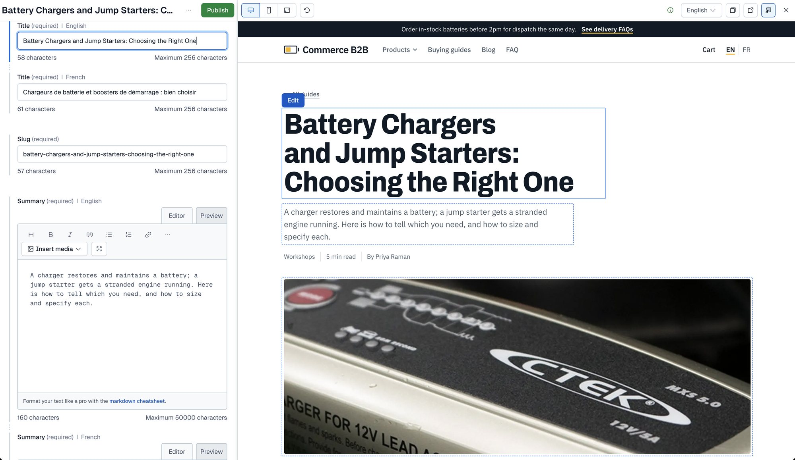
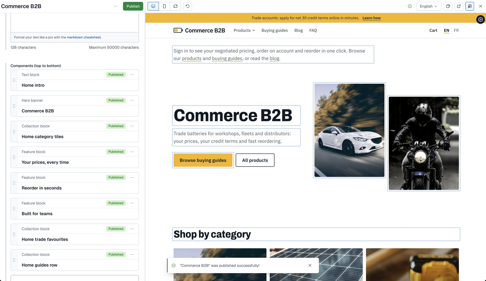
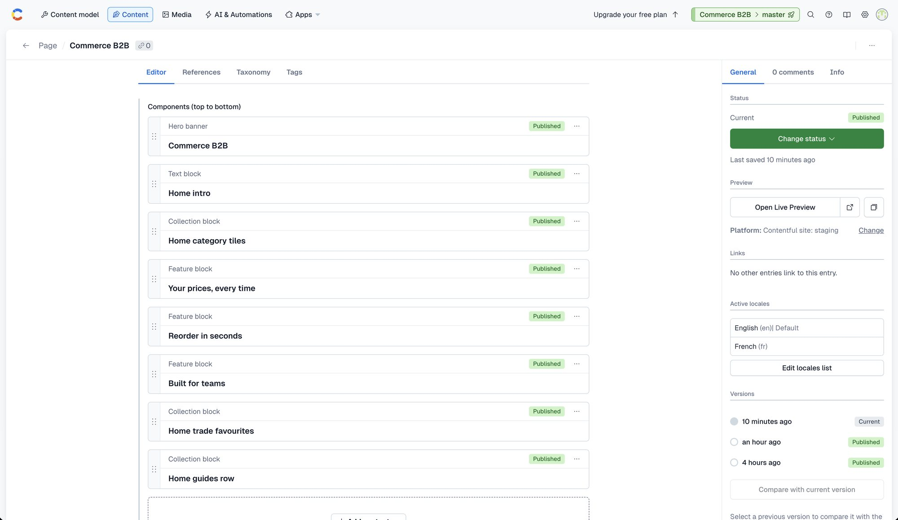
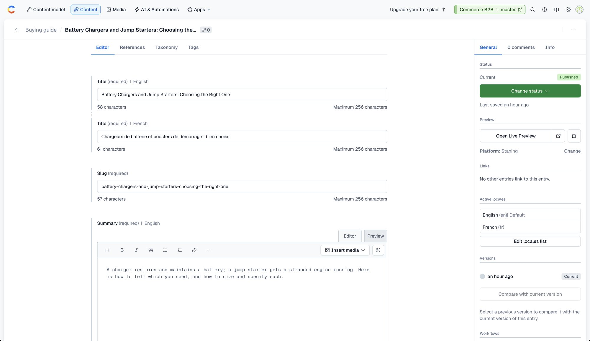

# Live Preview (visual editing)

Contentful's **Live Preview** opens the real site next to the entry form. With **inspector mode**, editors click an element on the
page to jump to its field in the form. Because pages and posts are ordered lists of blocks, editors can also **reorder blocks** in the page entry and see the result in the preview. The Free plan has no separate visual editor product; this is the editing experience here.

## How it fits together

```
Contentful web app ── "Open Live Preview" ──► storefront page  ?cf_preview=<secret>
        ▲                                          │ Live Preview SDK (loaded only in preview)
        └── save events / field clicks ◄───────────┘
```

1. In an entry, **Open Live Preview** loads `<preview platform URL>` for the entry's content type in a frame next to the form. The URL
   comes from the content preview settings, with the entry's slug and locale filled in.
2. The URL carries `cf_preview=<secret>`. `proxy.ts` checks it and, only if it matches, tells the app the request is a preview (`x-preview`).
   The app then reads **drafts** with the Preview token, and the mapped content carries `$`, from which components add
   `data-contentful-entry-id`, `data-contentful-field-id` and `data-contentful-locale` attributes to the elements.
3. `components/edit-support.tsx` renders `providers/cms/contentful/edit-support.tsx` and `live-preview.tsx`, which start the Live Preview SDK
   **only in preview**. The SDK outlines the tagged elements and tells the editor which field was clicked.
4. While the editor **types**, the client finds the entries tagged on the page in the DOM, asks the server action `previewBaseline` for their
   saved values, and subscribes with the SDK, which hands back the unsaved values. Changed fields (text, long text, dates, numbers, booleans,
   lists, rich text) are sent to `updatePreviewOverlay`, which keeps them in memory for five minutes and calls `refresh()` so the page is
   re-rendered in the same response, so changes appear as they are made (D31).
5. When the editor **saves** an entry (Contentful autosaves shortly after typing stops), the SDK delivers a save event, the overlay and
   the 5-second draft cache are cleared and the page is re-rendered from the new draft. A block added in the editor and replaced media
   update at this step; reordering or removing blocks already shows while you drag.


*The entry form: the sidebar has **Open Live Preview** under Preview. (This screenshot shows a post from before the block model: the body is now a list of content blocks.)*


English buying guide: the outlined title is focused and its field is open in the left pane.



The home page: hero, image, intro and blocks are all tagged.


*Live Preview of the home page after reordering its components and publishing: the text block `Home intro` now sits above the hero. Reordering or removing blocks also shows while you drag (D31).*

A page is an ordered list of components; drag them to reorder:



## How draft mode is switched on

`proxy.ts` runs `previewGate()` (`providers/cms/gates.ts`) on every request: it returns true only when the request carries `cf_preview` **and**
its value equals `CONTENTFUL_PREVIEW_SECRET` (compared in constant time). Only then does the proxy forward the header `x-preview: 1`; any
`x-preview` a client sends is deleted first, so it cannot be spoofed. The app reads it with `isPreviewRequest()` (`lib/request.ts`). In
development any `cf_preview` value is accepted, so `?cf_preview=1` is enough locally. The server actions of Live Preview run the same gate
with the secret the page was opened with.

Without that check, anyone could add `?cf_preview=1` to a URL and read unpublished content. On the live site a bare `?cf_preview=1`, a
wrong secret and a missing secret all return the published page with no editing markup. The secret lives only in `.env.local`, the
deployment variables and Contentful's preview settings (which only space editors can read).

## Edit attributes

Contentful selects **fields**. The mapper gives each draft entity a `$` object (`providers/cms/contentful/mapper.ts`, `editTags()` in `client.ts`): a
Proxy, so `$.title`, `$.image`, `$.html`… each yield the three attributes for that entry and field. Components spread them with
`tag(entity, field)` (`core/edit.ts`), for example `<h2 {...tag(block, "title")}>`. Model field names are mapped to Contentful field ids per
content type (`html` is `copy` on a `featureBlock` and `text` on a `textBlock`; `image` is `heroImage` on a `buyingGuide`, `featuredImage` on
a `blogPost`). Linked pieces (a guide step, a hero, a block) are tagged with **their own entry id**, so a click opens that entry. In published
HTML the tags are empty.

## The Live Preview SDK (`providers/cms/contentful/live-preview.tsx`)

- `ContentfulLivePreview.init({ locale, space, environment, enableInspectorMode: true, enableLiveUpdates: true, targetOrigin })`, with the locale
  from the route (`en` / `fr`).
- `enableLiveUpdates` **must be true**: the SDK only delivers the save event when it is on (D31), even though the pages subscribe to no data.
- `targetOrigin` is `https://app.contentful.com` and `https://app.eu.contentful.com`; in development the framing page's origin (the referrer)
  is allowed too, so a localhost test harness works.
- `init` is wrapped in `try/catch`: the SDK **throws** when the parent is not a supported origin, and an unguarded throw replaced the whole page
  with the error screen (D32). A page opened in a bare tab now renders normally, without click-to-edit.

## Content preview setup

`python3 tools/contentful/editor.py` creates one **preview platform** per origin (Settings → Content preview): local always, and production and
staging when `PREVIEW_PRODUCTION` / `PREVIEW_STAGING` are set to their origins. For this site run it with `PREVIEW_PREFIX=storefront` and
`PREVIEW_LABEL="Contentful site"`: the platforms are `storefront-local|production|staging`, named *Contentful site: local (npm run dev:https)*,
*Contentful site: production* and *Contentful site: staging* (the private switchable repo uses the prefix `ccb`, so both share the space). Each has a URL per content type,
using the editor's tokens `{locale}` and `{entry_field.slug}`, and ends in `?cf_preview=<secret>` (read from `.env.local`, never printed):

| Content type | URL path |
|---|---|
| `page` | `/{locale}/{entry_field.slug}` (`/en/home`, `/fr/faq`…) |
| `blogPost` | `/{locale}/blog/{entry_field.slug}` |
| `author` | `/{locale}/blog` |
| `buyingGuide` | `/{locale}/guides/{entry_field.slug}` |
| `faq` | `/{locale}/faq` |
| `productSpotlight`, `announcementBar`, `siteNavigation`, `heroBanner`, `featureBlock`, `textBlock`, `imageBlock`, `videoBlock`, `collectionBlock` | `/{locale}/home` (the page that shows them) |

`proxy.ts` only needs one mapping for this: `/home` and `/fr/home` are served by the home pages. `/en/...` redirects (308, keeping the query)
to the clean URL. The proxy sets the CSP `frame-ancestors` header per request: only `https://app.contentful.com` and
`https://app.eu.contentful.com` (and `localhost` in development).

## Languages


*Switching locales in Live Preview is a Premium-plan feature: on the Free plan the preview locale stays English.*

On the Free plan the editor always fills `{locale}` with `en`, so a French entry opens the English page (D30). To edit French:

1. Open **Live Preview** on the entry, and use the storefront's own **EN / FR** switcher inside the preview.
2. The French page renders with French draft content, and its edit tags carry `data-contentful-locale="fr"`, so clicking an element focuses the
   **French** field in the form.


The preview platform is chosen per entry (here *Staging*; *Production* and *Local* are the other two):


*The French post, reached with the site's language switcher inside Live Preview: French content, and the outlines target the French fields.*

With a Premium plan the editor's locale menu would pass `fr` and the template would open `/fr/...` directly.

## Using it

1. In Contentful open **Content**, pick an entry (a blog post, a guide, the `home` page…).
2. Click **Open Live Preview** in the sidebar.
3. To reorder the page, open the `page` entry and drag the entries in **Components**; click an outlined element to edit its field; type: text, dates, numbers, lists, rich text and the order of the blocks show up as you type, an added block or replaced media after the autosave. **Publish** makes the change live.

Typed updates cover every field type, including the order of linked blocks, except a block added in the editor and replaced media (D31): those follow each save.

## Troubleshooting

| Symptom | Cause | Fix |
|---|---|---|
| Blank frame, "refused to connect" | the CSP does not allow the editor, or the platform URL is wrong | check the `Content-Security-Policy` header and the preview platform URL |
| Page loads but shows no outlines | draft mode not on (wrong secret), or the preview token differs from the deployment's | re-run `editor.py` after changing `CONTENTFUL_PREVIEW_SECRET`; check the variable on that deployment |
| Page shows published content in the preview | same as above, or the entry has no unpublished changes | check the secret; edit the entry |
| Edits do not appear after typing | the edit/save events are not delivered, or the draft request lacks the secret | `enableLiveUpdates` must be `true`; wait for the autosave; check the console for "Live Preview not started" |
| French entry opens the English page | the Free plan cannot switch the preview locale | use the storefront's EN / FR switcher inside the preview (D30) |
| Whole page replaced by an error screen | the SDK threw (unsupported parent origin) | `init` must stay inside `try/catch`; check `targetOrigin` |
| Local editing fails | the editor requires HTTPS | `npm run dev:https` and accept the certificate once |
| A template token is not replaced | token name unsupported | check the editor's preview URL for the entry and adjust `PATHS` in `editor.py` |

## Screenshots to refresh

These images in `docs/images/` predate the block model (a post with a `Body` field) and are kept until they are retaken:
`cf-entry-editor.jpg` and `cf-live-preview-en.jpg`.
