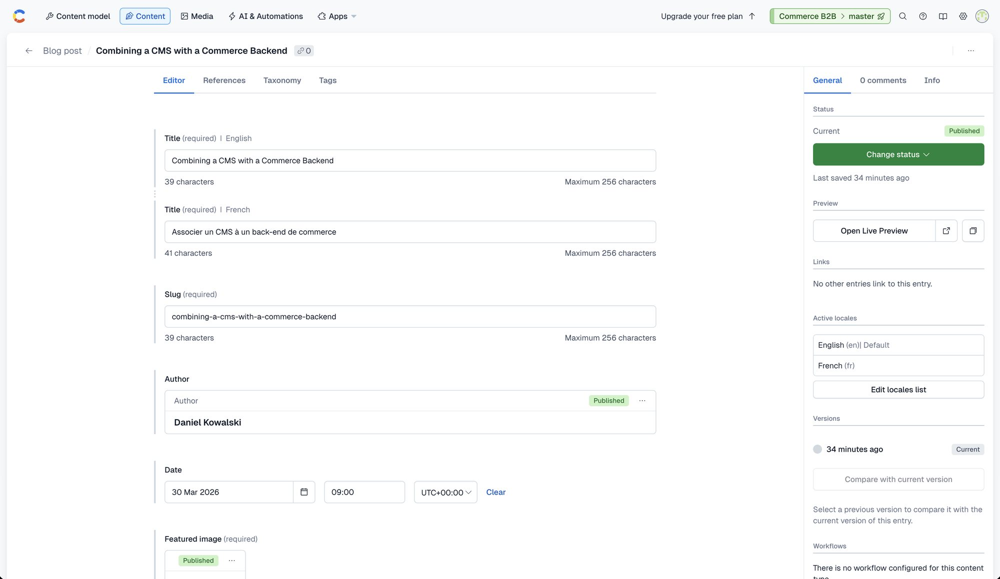
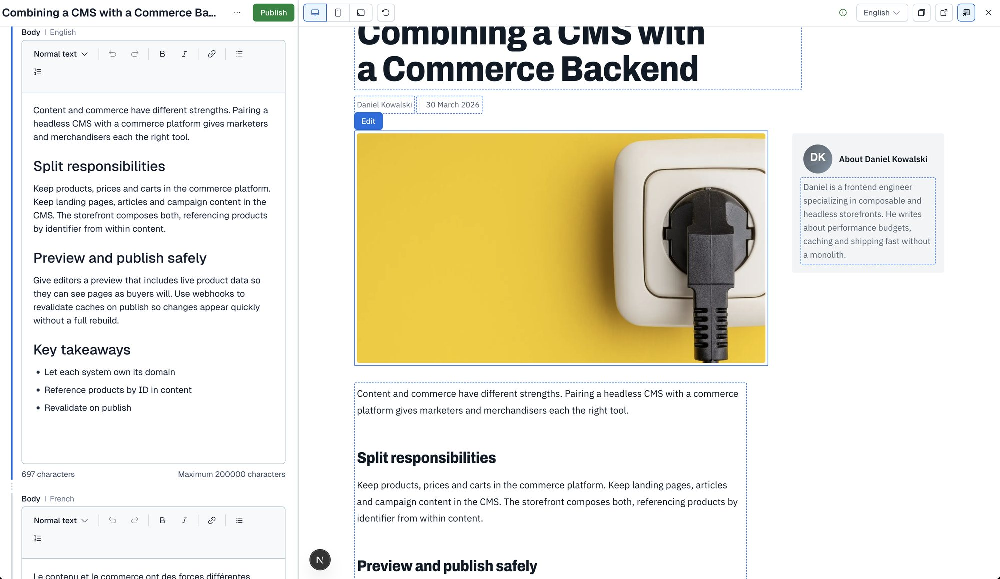
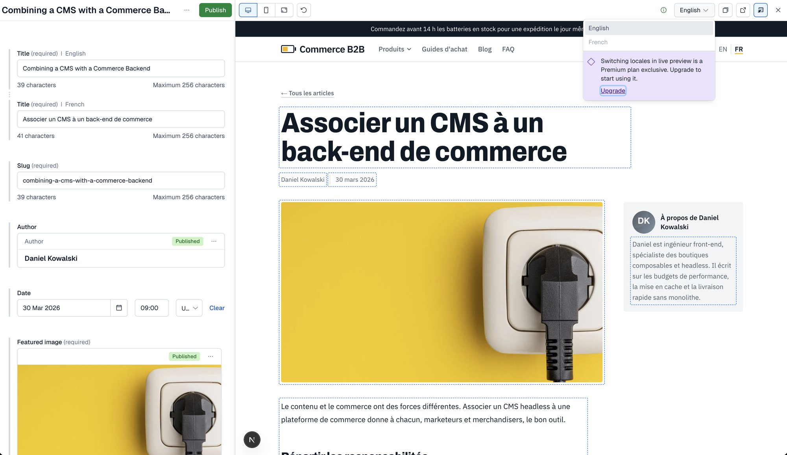

# Live Preview (visual editing)

Contentful's **Live Preview** opens the real site next to the entry form. With **inspector mode**, editors click an element on the
page to jump to its field in the form. The Free plan has no separate visual editor product; this is the editing experience here.

## How it fits together

```
Contentful web app ── "Open Live Preview" ──► storefront page  ?cf_preview=<secret>
        ▲                                          │ Live Preview SDK (loaded only in preview)
        └── save events / field clicks ◄───────────┘
```

1. In an entry, **Open Live Preview** loads `<preview platform URL>` for the entry's content type in a frame next to the form. The URL
   comes from the content preview settings, with the entry's slug and locale filled in.
2. The URL carries `cf_preview=<secret>`. The server recognises it, reads **drafts** with the Preview token, and adds
   `data-contentful-entry-id`, `data-contentful-field-id` and `data-contentful-locale` attributes to the elements.
3. `components/edit-support.tsx` renders `components/live-preview.tsx`, which starts the Live Preview SDK **only in preview**.
   The SDK outlines the tagged elements and tells the editor which field was clicked.
4. When the editor **saves** an entry (Contentful autosaves shortly after typing stops), the SDK delivers a save event and the page calls
   `router.refresh()`; the server re-renders from the new draft.


*The entry form: the sidebar has **Open Live Preview** under Preview.*


*Live Preview: dashed outlines mark the editable elements; clicking one focuses its field in the form (here the body).*

## How draft mode is switched on

`previewParams()` in `lib/contentful.ts` returns a draft flag only when the request carries `cf_preview` **and** its value equals
`CONTENTFUL_PREVIEW_SECRET` (compared in constant time). In development any value is accepted, so `?cf_preview=1` is enough locally.

Without that check, anyone could add `?cf_preview=1` to a URL and read unpublished content. On the live site a bare `?cf_preview=1`, a
wrong secret and a missing secret all return the published page with no editing markup. The secret lives only in `.env.local`, the
deployment variables and Contentful's preview settings (which only space editors can read).

## Edit attributes

Contentful selects **fields**. `editTags()` returns a Proxy, so `entry.$.title`, `entry.$.hero_image`, `entry.$.steps__parent`… each yield
the three attributes for that entry and field. Shape names are mapped to field ids: `snake_case` becomes `camelCase`
(`hero_image` → `heroImage`) with a few overrides (`banner_image` → `image`, `call_to_action` → `ctaLabel`, `rich_text` → `intro`). Linked
pieces (a guide step, a hero) are tagged with **their own entry id**, so a click opens that entry. In published HTML the tags are empty.

## The Live Preview SDK (`components/live-preview.tsx`)

- `ContentfulLivePreview.init({ locale, space, environment, enableInspectorMode: true, enableLiveUpdates: true, targetOrigin })`, with the locale
  from the route (`en` / `fr`).
- `enableLiveUpdates` **must be true**: the SDK only delivers the save event when it is on (D31), even though the pages subscribe to no data.
- `targetOrigin` is `https://app.contentful.com` and `https://app.eu.contentful.com`; in development the framing page's origin (the referrer)
  is allowed too, so a localhost test harness works.
- `init` is wrapped in `try/catch`: the SDK **throws** when the parent is not a supported origin, and an unguarded throw replaced the whole page
  with the error screen (D32). A page opened in a bare tab now renders normally, without click-to-edit.

## Content preview setup

`python3 scripts/seed/editor.py` creates one **preview platform** per origin (Settings → Content preview): `Local (npm run dev:https)`
always, and Production and Staging when `PREVIEW_PRODUCTION` / `PREVIEW_STAGING` are set to their origins. Each has a URL per content type,
using the editor's tokens `{locale}` and `{entry_field.slug}`, and ends in `?cf_preview=<secret>` (read from `.env.local`, never printed):

| Content type | URL path |
|---|---|
| `page` | `/{locale}/{entry_field.slug}` (`/en/home`, `/fr/faq`…) |
| `blogPost` | `/{locale}/blog/{entry_field.slug}` |
| `blogListingPage`, `author` | `/{locale}/blog` |
| `buyingGuide` | `/{locale}/guides/{entry_field.slug}` |
| `faq` | `/{locale}/faq` |
| `productSpotlight`, `announcementBar`, `siteNavigation`, `heroBanner`, `featureBlock` | `/{locale}/home` (the page that shows them) |

`proxy.ts` only needs two mappings for this: `/home` and `/fr/home` are served by the home pages. `/en/...` redirects (308, keeping the query)
to the clean URL. The CSP `frame-ancestors` header allows only `https://app.contentful.com` and `https://app.eu.contentful.com` (and
`localhost` in development).

## Languages


*Switching locales in Live Preview is a Premium-plan feature: on the Free plan the preview locale stays English.*

On the Free plan the editor always fills `{locale}` with `en`, so a French entry opens the English page (D30). To edit French:

1. Open **Live Preview** on the entry, and use the storefront's own **EN / FR** switcher inside the preview.
2. The French page renders with French draft content, and its edit tags carry `data-contentful-locale="fr"`, so clicking an element focuses the
   **French** field in the form.


*The French post, reached with the site's language switcher inside Live Preview: French content, and the outlines target the French fields.*

With a Premium plan the editor's locale menu would pass `fr` and the template would open `/fr/...` directly.

## Using it

1. In Contentful open **Content**, pick an entry (a blog post, a guide, the `home` page…).
2. Click **Open Live Preview** in the sidebar.
3. Click an outlined element to edit its field; type; wait for the autosave, and the page refreshes. **Publish** makes the change live.

Per-keystroke updates are **not** implemented (D31): the pages are server-rendered, so a refresh follows each save.

## Troubleshooting

| Symptom | Cause | Fix |
|---|---|---|
| Blank frame, "refused to connect" | the CSP does not allow the editor, or the platform URL is wrong | check the `Content-Security-Policy` header and the preview platform URL |
| Page loads but shows no outlines | draft mode not on (wrong secret), or the preview token differs from the deployment's | re-run `editor.py` after changing `CONTENTFUL_PREVIEW_SECRET`; check the variable on that deployment |
| Page shows published content in the preview | same as above, or the entry has no unpublished changes | check the secret; edit the entry |
| Edits do not appear after typing | the save event is not delivered | `enableLiveUpdates` must be `true`; wait for the autosave; check the console for "Live Preview not started" |
| French entry opens the English page | the Free plan cannot switch the preview locale | use the storefront's EN / FR switcher inside the preview (D30) |
| Whole page replaced by an error screen | the SDK threw (unsupported parent origin) | `init` must stay inside `try/catch`; check `targetOrigin` |
| Local editing fails | the editor requires HTTPS | `npm run dev:https` and accept the certificate once |
| A template token is not replaced | token name unsupported | check the editor's preview URL for the entry and adjust `PATHS` in `editor.py` |

## Screenshots still to add

- `cf-content-model.jpg`: the content model list (Content model page).
- `cf-content-list.jpg`: the content list with entries and statuses.
- `cf-media.jpg`: the media library with the 62 assets.
